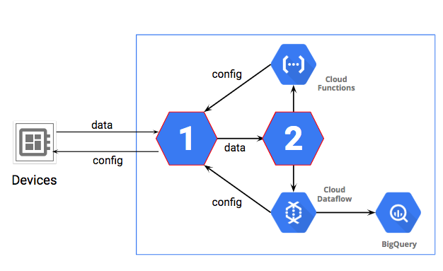

Data Engineer Practice Exam
===========================

> **Q. Storage of JSON files with occasionally changing schema, for ANSI SQL queries.**

A. Store in BigQuery. Provide format files for data load and update them as needed.

B. Store in BigQuery. Select "Automatically detect" in the Schema section.

C. Store in Cloud Storage. Link data as temporary tables in BigQuery and turn on the "Automatically detect" option in the Schema section of BigQuery.

D. Store in Cloud Storage. Link data as permanent tables in BigQuery and turn on the "Automatically detect" option in the Schema section of BigQuery.

---
**Correct. B.** This is correct because of the requirement to support occasionally (schema) changing JSON files and aggregate ANSI SQL queries: you need to use BigQuery, and it is quickest to use 'Automatically detect' for schema changes.

---
> **Q. Low-cost one-way one-time migration of two 100-TB file servers to Google Cloud; data will be frequently accessed and only from Germany.**

A. Use Transfer Appliance. Transfer to a Cloud Storage Standard bucket.  

B. Use Transfer Appliance. Transfer to a Cloud Storage Nearline bucket.  

**Not C.** Use Storage Transfer Service. Transfer to a Cloud Storage Standard bucket.  

**Not D.** Use Storage Transfer Service. Transfer to a Cloud Storage Coldline bucket.  

---
**Not C-D.** This is not correct because you should only use Transfer Service for a one-time one-way transfer. Also, Storage Transfer Service does not work for data stored on-premises.  
**Correct A.** This is correct because you are performing a one-time (rather than an ongoing series) data transfer from on-premises to Google Cloud for users in a single region (Germany). Using a Standard storage bucket is best for data that is frequently accessed, will reduce cost and also conform to regulatory requirements.

---
> **Q. Cost-effective backup to Google Cloud of multi-TB databases from another cloud including monthly DR drills.**

A. Use Transfer Appliance. Transfer to Cloud Storage Nearline bucket.

B. Use Transfer Appliance. Transfer to Cloud Storage Coldline bucket.

C. Use Storage Transfer Service. Transfer to Cloud Storage Nearline bucket.

**Not D.** Use Storage Transfer Service. Transfer to Cloud Storage Coldline bucket.

---
**Correct C.** This is correct because you will need to access your backup data monthly to test your disaster recovery process, so you should use a Nearline bucket; also because you will be performing ongoing, regular data transfers, so you should use Storage Transfer Service.
**Not D**. This is not correct because you should not use Coldline if you want to access the files monthly.  

---
> **Q. 250,000 devices produce a JSON device status every 10 seconds. How do you capture event data for outlier time series analysis?**

A. Capture data in BigQuery. Develop a BigQuery API custom application to query the dataset and display device outlier data.

B.Capture data in BigQuery. Use the BigQuery console to query the dataset and display device outlier data.

C. Capture data in Cloud Bigtable. Use the Cloud Bigtable cbt tool to display device outlier data.

D. Capture data in Cloud Bigtable. Install and use the HBase shell for Cloud Bigtable to query the table for device outlier data.

---
**Correct. C.** This is correct because the data type, volume, and query pattern best fit Cloud Bigtable capabilities.

---
> **Q. Event data in CSV format to be queried for individual values over time windows. Which storage and schema to minimize query costs?**

A. Use Cloud Storage. Join the raw file data with a BigQuery log table.

B. Use Cloud Bigtable. Design tall and narrow tables, and use a new row for each single event version.

C. Use Cloud Storage. Write a Dataprep job to split the data into partitioned tables.

D. Use Cloud Bigtable. Design short and wide tables, and use a new column for each single event version.

---
**Not C.** This is not correct because you do not need to use Google Cloud Storage for this scenario. It might be cheaper for storage, but not for processing. 
**Correct. B.** This is correct because it is a recommended best practice. Use Cloud Bigtable and this schema for this scenario. Cloud Storage would have cheaper STORAGE costs than Cloud Bigtable, but we want to minimize QUERY costs.

---
> **Q. Customer wants to maintain investment in an existing Apache Spark code data pipeline.**

A. BigQuery

B. Dataflow

C. Dataproc

D. Dataprep

---
**Correct. C.** This is correct because Dataproc is a managed Hadoop service and runs Apache Spark applications.

---
> **Q. Host a deep neural network machine learning model on Google Cloud. Run and monitor jobs that could occasionally fail.**

**Not A.** Use AI Platform to host your model. Monitor the status of the Operation object for 'error' results.

B. Use AI Platform to host your model. Monitor the status of the Jobs object for 'failed' job states.

C. Use a Google Kubernetes Engine cluster to host your model. Monitor the status of the Jobs object for 'failed' job states.

D. Use a Google Kubernetes Engine cluster to host your model. Monitor the status of the Operation object for 'error' results.

---
**Not A.**  This is not correct because you should not use the Operation object to monitor failures.
**Correct B.** This is correct because of the requirement to host an ML DNN. AI Platform for Tensorflow can handle DNNs. Google recommends monitoring Jobs, not Operations.

---

> **Q. Cost-effective way to run non-critical Apache Spark jobs on Dataproc?**

A. Set up a cluster in high availability mode with high-memory machine types. Add 10 additional local SSDs.

B. Set up a cluster in high availability mode with default machine types. Add 10 additional preemptible worker nodes.

C. Set up a cluster in standard mode with high-memory machine types. Add 10 additional preemptible worker nodes.

D. Set up a cluster in standard mode with the default machine types. Add 10 additional local SSDs.

---
**Correct. C.** This is correct because Spark and high-memory machines only need the standard mode. Also, use preemptible nodes because you want to save money and this is not mission-critical.

---
> **Q. Promote a Cloud Bigtable solution with a lot of data from development to production and optimize for performance.**

A. Change your Cloud Bigtable instance type from Development to Production, and set the number of nodes to at least 3. Verify that the storage type is HDD.

B. Change your Cloud Bigtable instance type from Development to Production, and set the number of nodes to at least 3. Verify that the storage type is SSD.

C. Export the data from your current Cloud Bigtable instance to Cloud Storage. Create a new Cloud Bigtable Production instance type with at least 3 nodes. Select the HDD storage type. Import the data into the new instance from Cloud Storage.

**Not D.** Export the data from your current Cloud Bigtable instance to Cloud Storage. Create a new Cloud Bigtable Production instance type with at least 3 nodes. Select the SSD storage type. Import the data into the new instance from Cloud Storage.

---
**Correct B.** This is correct because Cloud Bigtable allows you to 'scale in place,' which meets your requirements for this scenario.
**Not D.** This is not correct because creating a new Cloud Bigtable instance is extraneous and not needed to export; you can upgrade in place for nodes, but the storage type cannot be changed.

---
> **Q. As part of your backup plan, you want to be able to restore snapshots of Compute Engine instances using the fewest steps. **

A. Export the snapshots to Cloud Storage. Create disks from the exported snapshot files. Create images from the new disks.

B. Export the snapshots to Cloud Storage. Create images from the exported snapshot files.

C. Use the snapshots to create replacement disks. Use the disks to create instances as needed.

D. Use the snapshots to create replacement instances as needed.

---
**Correct. D.** This is correct because the scenario asks how to recreate instances. You can create an instance directly from a snapshot without restoring to disk first.

---
> **Q. You want to minimize costs to run Google Data Studio reports on BigQuery queries by using prefetch caching.**

A. Set up the report to use the Owner's credentials to access the underlying data in BigQuery, and direct the users to view the report only once per business day (24-hour period).

B. Set up the report to use the Owner's credentials to access the underlying data in BigQuery, and verify that the 'Enable cache' checkbox is selected for the report.

**Not C.** Set up the report to use the Viewer's credentials to access the underlying data in BigQuery, and also set it up to be a 'view-only' report.

**Not D.** Set up the report to use the Viewer's credentials to access the underlying data in BigQuery, and verify that the 'Enable cache' checkbox is not selected for the report.

---
**Correct B.** This is correct because you must set Owner credentials to use the 'enable cache' option in BigQuery. It is also a Google best practice to use the ‘enable cache’ option when the business scenario calls for using prefetch caching. 1) Report must use Owner's Credentials. 2) You don't need to tell the users not to use the report, you need to tell the system to use Query and Pre-fetch caching to cut down on BigQuery jobs.
**Not C-D.** This is not correct because a cache auto-expires every 12 hours; a prefetch cache is only for data sources that use the Owner's credentials (not the Viewer's credentials).

---
> **Q. A Data Analyst is concerned that a BigQuery query could be too expensive.**

A. Use the LIMIT clause to limit the number of values in the results.

B. Use the SELECT clause to limit the amount of data in the query. Partition data by date so the query can be more focused.

C. Set the Maximum Bytes Billed, which will limit the number of bytes processed but still run the query if the number of bytes requested goes over the limit.

D. Use GROUP BY so the results will be grouped into fewer output values.

---
**Correct B.** This is correct. SELECT limits the input data.

---
> **Q. BigQuery data is stored in external CSV files in Cloud Storage; as the data has increased, the query performance has dropped.**

A. Import the data into BigQuery for better performance.

**Not B.** Request more slots for greater capacity to improve performance.

**Not C.** Divide the data into partitions based on date.

D. Time to move to Cloud Bigtable; it is faster in all cases.

---
**Not B.** This is incorrect because a slot is a measure of processing power, and the bottleneck is in the data access, not the data processing.
**Not C.** This might improve performance by focusing the query to a date-range if the data was already imported into a dataset.

---
> **Q. Source data is streamed in bursts and must be transformed before use.**

A. Use Cloud Bigtable for fast input and cbt for ETL.

B. Ingest data to Cloud Storage. Use Dataproc for ETL.

C. Use Pub/Sub to buffer the data, and then use BigQuery for ETL.

D. Use Pub/Sub to buffer the data, and then use Dataflow for ETL.

---
**Correct D.** This is correct because the unpredictable data requires a buffer

---
> **Q. Calculate a running average on streaming data that can arrive late and out of order.**

A. Use Pub/Sub and Dataflow with Sliding Time Windows.

B. Use Pub/Sub and Google Data Studio.

C. Pub/Sub can guarantee timely arrival and order.

D. Use Dataflow's built-in timestamps for ordering and filtering.

---
**Correct A.** This is correct because together, Pub/Sub and Dataflow can provide a solution.

---
> **Q. Testing a Machine Learning model with validation data returns 100% correct answers.**

A. The model is working extremely well, indicating the hyperparameters are set correctly.

B. The model is overfit. There is a problem.

C. The model is underfit. There is a problem.

D. The model is perfectly fit. You do not need to continue training.

---
**Correct B.** This is correct. The 100% accuracy is an indicator that the validation data may have somehow gotten mixed in with the training data. You will need new validation data to generate recognizable error.

---
> **Q. A client is using Cloud SQL database to serve infrequently changing lookup tables that host data used by applications. The applications will not modify the tables. As they expand into other geographic regions they want to ensure good performance. What do you recommend?**

A. Migrate to Cloud Spanner

B. Read replicas

C. Instance high availability configuration

**Not D.** Replicate from an external server

---
**Correct B.** This is correct. A read replica will increase the availability of the service and can be located closer to the users in the new geographies.
**Not D.** This feature replicates from an existing MySQL server IN to a Cloud SQL service. So that would not help in this circumstance.

---
> **Q. A client wants to store files from one location and retrieve them from another location. Security requirements are that no one should be able to access the contents of the file while it is hosted in the cloud. What is the best option?**

A. Default encryption should be sufficient

B. Client-side encryption

C. Customer-Supplied Encryption Keys (CSEK)

**Not D.** Customer Managed Encryption Keys (CMEK)

---
**Correct B.** This is correct. The requirement is that the file cannot be decrypted in the cloud, so encrypt it before it is uploaded and after it is downloaded adds a layer of encryption.
**Not D.** Not correct. The file can still be decrypted while hosted in the cloud.

---
> **Q. Three Google Cloud services commonly used together in data engineering solutions. (Described in this course).**

A. Dataproc, Cloud SQL, BigQuery

B. Pub/Sub, Dataflow, BigQuery

C. Pub/Sub,Google Kubernetes Engine, Spanner

D. Bigtable, Dataproc, Cloud Spanner

---
**Correct B.** Pub/Sub provides messaging, Dataflow is used for ETL and data transformation, and BigQuery is used for interactive queries.

---
> **Q. What is AVRO used for?**

A. Serialization and de-serialization of data so that it can be transmitted and stored while maintaining an object structure.

B. AVRO is an encryption method. AVRO-256 is a 256-bit key standard.

C. AVRO is a file type usually specified with *.avr and a common format for spreadsheets.

D. AVRO is a numerical type in SQL that stores a 38 digit value with 9 digit decimal representation. It avoids rounding errors in financial calculations.

---
**Correct A.** AVRO is a serialization / de-serialization standard.

---
> **Q. A company has a new IoT pipeline. Which services will make this design work? Select the services that should be used to replace the icons with the number "1" and number "2" in the diagram.**

A. IoT Core, Datastore

**Not B.** Pub/Sub, Storage

C. IoT Core, Pub/Sub

D. App Engine, IoT Core

---
**Not A.** This is not correct because IoT Core does not publish to other services and it doesn't store data.
**Not B.** This is not correct because Pub/Sub does not do device management.

---
> **Q. A company wants to connect cloud applications to an Oracle database in its data center. Requirements are a maximum of 9 Gbps of data and a Service Level Agreement (SLA) of 99%.**

A. Implement a high-throughput Cloud VPN connection

**Not B.** Cloud Router with VPN

**Not C.** Dedicated Interconnect

D. Partner Interconnect

---
**Not B.** This is not correct. Cloud Router is a form of network route discovery using BGP and is not relevant to the requirements.
**Not C.** This is not correct. Direct Interconnect is useful for data from 10 Gbps to 80 Gbps. An ISP could offer a 99% SLA, but the max 9 Gbps requirement means this solution would not be optimal.

---
> **Q. A client has been developing a pipeline based on PCollections using local programming techniques and is ready to scale up to production. What should they do?**

A. They should use the Dataflow Cloud Runner.

B. They should upload the pipeline to Dataproc.

C. They should use the local version of runner.

D. Import the pipeline into BigQuery.

---
**Correct A.** This is correct. The PCollection indicates it is a Dataflow pipeline. And the Cloud Runner will enable the pipeline to scale to production levels.

---
> **Q. A company has migrated their Hadoop cluster to the cloud and is now using  Dataproc with the same settings and same methods as in the data center. What would you advise them to do to make better use of the cloud environment?**

A. Upgrade to the latest version of HDFS. Change the settings in Hadoop components to optimize for the different kinds of work in the mix.

B. Find more jobs to run so the cluster utilizations will cost-justify the expense.

C. Store persistent data off-cluster. Start a cluster for one kind of work then shut it down when it is not processing data.

D. Migrate from Dataproc to an open source Hadoop Cluster hosted on Compute Engine, because this is the only way to get all the Hadoop customizations needed for efficiency.

---
**Correct C.** This is correct. Storing persistent data off the cluster allows the cluster to be shut down when not processing data. And it allows separate clusters to be started per job or per kind of work, so tuning is less important.

---
> **Q. An application has the following data requirements. 1. It requires strongly consistent transactions. 2. Total data will be less than 500 GB. 3. The data does not need to be streaming or real time. Which data technology would fit these requirements?**

A. BigQuery

B. Cloud Bigtable

C. Cloud SQL

D. Memorystore

---
**Correct C.** This is correct. Cloud SQL supports strongly consistent transactions. And the size requirements will fit with a Cloud SQL instance.

---
